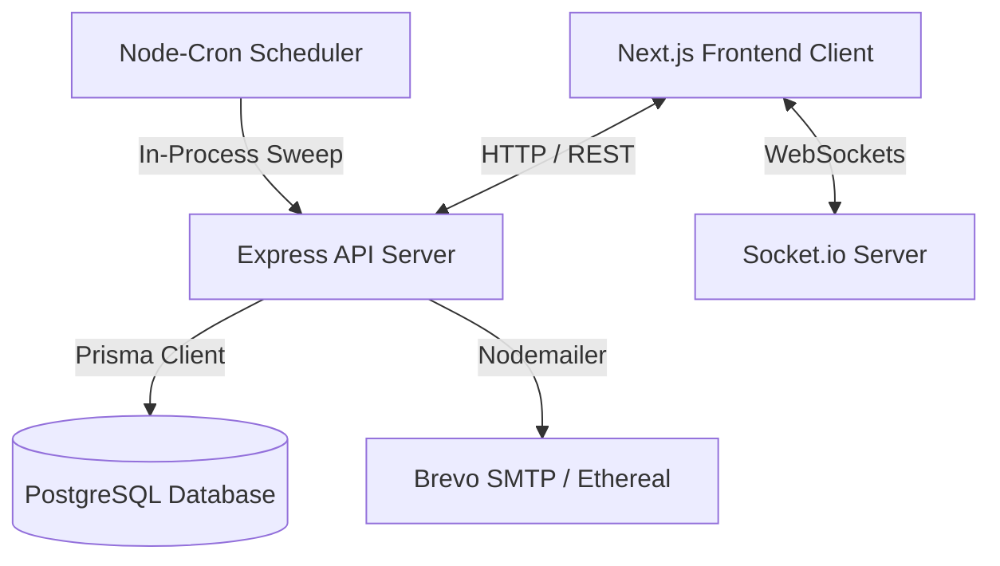
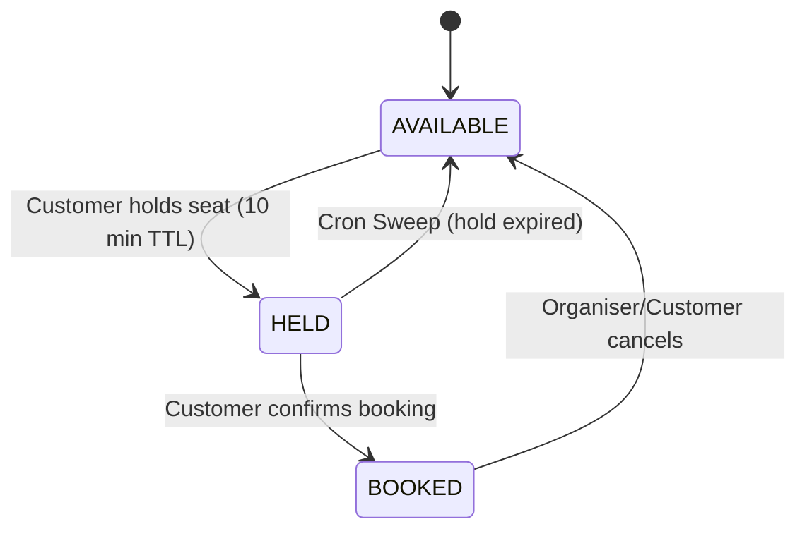
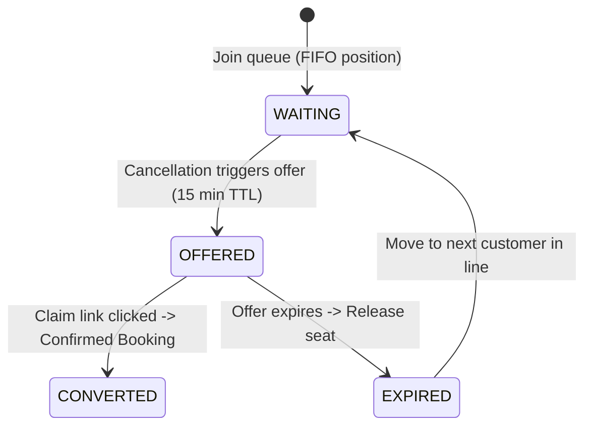

# Ticket Booking System - System Design Document

This document outlines the architecture, database design, concurrency controls, and real-time synchronization mechanisms for the Ticket Booking System.

---

## 1. Architectural Overview

The system is designed as a full-stack, real-time ticket booking platform for high-concurrency events (e.g., movies and concerts). The primary goal is to ensure transactional consistency for seat mapping and automated waitlist assignment without the overhead of paid distributed components like Redis or Amazon SQS.



### Component Breakdown
1. **Frontend**: Next.js 14 (App Router) + TypeScript + Tailwind CSS. Connects to REST endpoints for operations (auth, confirm, waitlist join) and opens a Socket.io client connection to receive seat status broadcasts.
2. **Backend**: Node.js + Express + TypeScript. Handles business logic and runs in-process cron schedulers.
3. **Database**: PostgreSQL with Prisma ORM. Leverages ACID properties and row-level locking for concurrency correctness.
4. **Real-time Engine**: Socket.io integrated with the HTTP server, mapping socket connections to rooms defined by `showId`.
5. **Scheduler**: `node-cron` running in-process sweeps for ticket hold timeouts and waitlist offer expirations.

---

## 2. Concurrency Control and Race Prevention

The primary technical challenge of a ticketing platform is ensuring that two customers cannot purchase or hold the same seat simultaneously.

### The Problem: Read-then-Write Race Conditions
A naive implementation reads the status of a seat, checks if it is `'AVAILABLE'`, and if so, writes `'HELD'` in a subsequent query. Under high load, multiple threads can read `'AVAILABLE'` before the first write commits, resulting in double-booking.

### The Solution: Atomic Conditional Updates
To achieve absolute correctness under load without external distributed locks, the system relies on PostgreSQL's row-level locking during conditional updates:

```ts
const result = await prisma.showSeat.updateMany({
  where: {
    id: showSeatId,
    status: 'AVAILABLE'
  },
  data: {
    status: 'HELD',
    heldBy: userId,
    heldUntil: new Date(Date.now() + TTL_MS)
  }
});

if (result.count === 0) {
  throw new ConflictError('Seat is no longer available');
}
```

#### Why it is Safe:
1. When PostgreSQL executes `UPDATE show_seats SET status = 'HELD' WHERE id = X AND status = 'AVAILABLE'`, it acquires an exclusive write lock on that row.
2. If two concurrent transactions execute this statement, the database serializes them. The first transaction acquires the lock, changes the status to `'HELD'`, and commits.
3. The second transaction then evaluates the row. Because the status is now `'HELD'`, the `WHERE` clause `status = 'AVAILABLE'` evaluates to false, matching zero rows.
4. The backend checks `result.count`. Since it is `0`, the second request is safely rejected with a `409 Conflict`.

---

## 3. Seat Hold TTL & Background Auto-Release

To prevent seats from being locked indefinitely by abandoned checkouts, seat holds are time-limited (`heldUntil`).



### The Sweep Mechanism
An in-process cron job (`holdExpiry.job.ts`) runs every 30 seconds to clean up abandoned holds:

```ts
await prisma.showSeat.updateMany({
  where: {
    status: 'HELD',
    heldUntil: { lt: new Date() }
  },
  data: {
    status: 'AVAILABLE',
    heldBy: null,
    heldUntil: null
  }
});
```

To ensure the frontend is updated instantly when holds expire, the system queries which seats were affected and broadcasts a `seat:released` event over the corresponding Socket.io rooms.

---

## 4. Waitlist Automation and Queue State Machine

When a seat category is sold out, users can join a FIFO waitlist (`WaitlistEntry`) for a specific `(showId, categoryId)`.



### FIFO Queue Progression:
1. **Joining**: Users are appended with a sequential `position` within the category queue.
2. **Cancellation Hook**: When a booking is cancelled:
   - The booking's seats are marked `AVAILABLE`.
   - The system checks for the next `WAITING` entry in that category.
   - If found, the entry is flipped to `OFFERED`, `offerExpiresAt` is set to `now + WAITLIST_OFFER_TTL_MINUTES`, and a signed token is emailed to the user.
   - The seat itself is put into the `HELD` state for that specific customer so public users cannot steal it during the claim window.
3. **Queue Advancement**: If a waitlist offer expires without being claimed, the `waitlistOffer.job.ts` cron job runs:
   - Flips the entry to `EXPIRED`.
   - Releases the seat.
   - Automatically triggers the offer flow for the next customer in the queue.

---

## 5. Real-Time Synchronization via WebSockets

To minimize database polling and provide a responsive user experience, seat-map changes are synchronized in real-time.

1. **Room Scoping**: When a client visits the seat-map page for `showId`, they emit a `join:show` Socket.io event. The server registers the socket into the room named `showId`.
2. **Instant Broadcasts**:
   - Holding a seat emits `seat:held` (updating status to HELD for all users in the room).
   - Releasing a seat (manual or cron) emits `seat:released`.
   - Completing checkout emits `seat:booked`.
3. **Initial Load Fallback**: REST endpoints are used strictly for initial page load and authentication; all subsequent updates are socket-driven.

---

## 6. Scaling Considerations

Although built with in-process tools (cron jobs, memory-based Socket.io), the system design can scale by:
- Swapping the default Node.js memory Socket.io adapter with the `@socket.io/redis-adapter` to allow horizontal clustering of API nodes.
- Moving the background jobs from `node-cron` to a database-backed task scheduler like `Graphile Worker` or `BullMQ` to ensure single-execution guarantees across cluster nodes.
